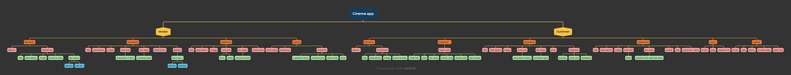
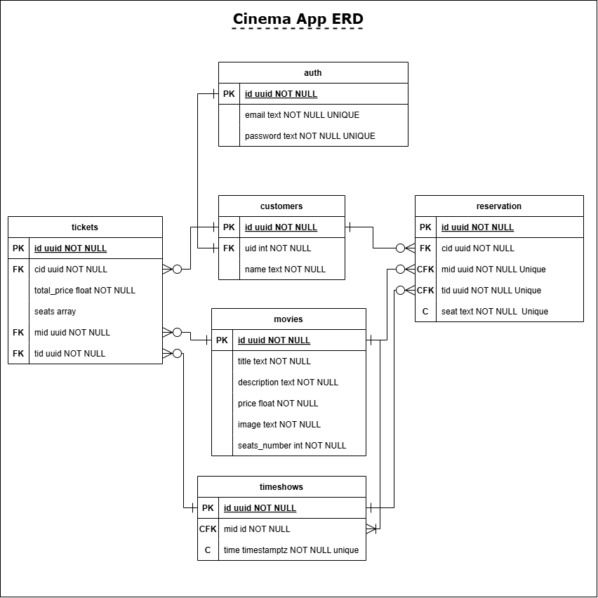

# Cinema App

This is a Flutter project for a movie ticket booking app.

## Getting Started

This project is a starting point for a Flutter application.

A few resources to get you started if this is your first Flutter project:

- [Lab: Write your first Flutter app](https://docs.flutter.dev/get-started/codelab)
- [Cookbook: Useful Flutter samples](https://docs.flutter.dev/cookbook)

For help getting started with Flutter development, view the
[online documentation](https://docs.flutter.dev/), which offers tutorials,
samples, guidance on mobile development, and a full API reference.

## Screenshots

## Features

- User can view movie list
- User can view movie details
- User can book ticket
- User can view reservations in real time
- User can cancel reservation
- User can view ticket list
- User can view ticket details
- User can view statistics

## Built With

- [Flutter](https://flutter.dev/) - a UI toolkit for building natively compiled applications for mobile, web, and desktop from a single codebase.
- [Supabase](https://supabase.io/) - a PostgreSQL database that is secure, scalable, and easy to use.

## Backend

This folder contains the backend code for the movie ticket booking app.

## Configuration

This project uses Supabase for database and authentication. The configuration is stored in the .env file.

Goto <a href="./backend/">backend</a>
