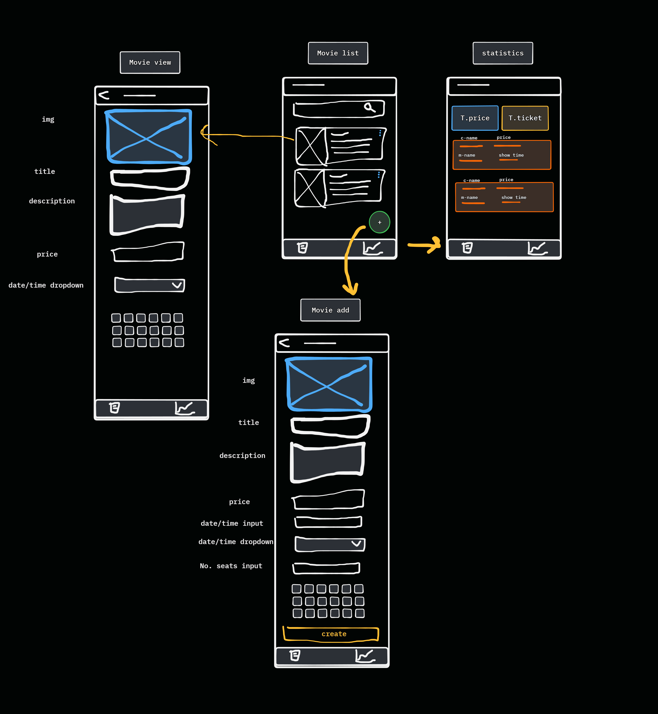

## Task Summary

- Build Add Movie page.
- allow vendor to upload image.
- set title, description, price, seats number, time shows.

## Details

- **Objective:** allow vendor to add movie.  
- **Specifications:** NONE.
- **Steps:**
  - take movie details.
  - upload image to `uploads` bucket.
  - add movie details with the image path.
  - add show times of that movie.
  
## Associated Story/Epic

- NONE.

## Acceptance Criteria

- allow upload image.
- allow add movie details.
- allow add movie that not exist before.

## Dependencies

- NONE.  

## Attachments

- Vendor Screen.

## Estimated Time

- 6 Hr  

## Notes/Additional Information

- NONE
