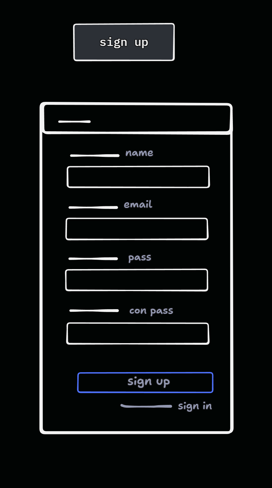

## Task Summary

- Build Sign up Form that take name, email, password, confirm password and sign up with them in supabase
- in case in valid credentials display proper error message

## Details

- **Objective:** create user.  
- **Specifications:** use supabase method "signUp".
- **Steps:**
  - take name, email, password, confirm password.
  - validate if email and password violate the security schema and if password and confirm password match.
  - try sign in with supabase sign up method.
  - if success continue to the login
  - else display proper error.

## Associated Story/Epic

- NONE  

## Acceptance Criteria

- allow sign up of users.  
- display error message on wrong credentials.

## Dependencies

- NONE.  

## Attachments

- Sign up Screen

## Estimated Time

- 4 Hr  

## Notes/Additional Information

- NONE
