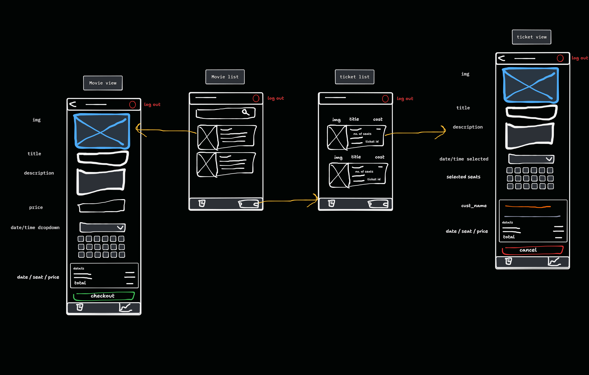

## Task Summary

- Build Ticket List page.
- list tickets by latest.
  - display movie title, movie image, seats, ticket id, cost.
- on click move to view ticket.

## Details

- **Objective:** list ticket.  
- **Specifications:** NONE.
- **Steps:**
  - on init get all tickets.
  - on click move to view ticket.
  
## Associated Story/Epic

- MovieList.
- MovieView.  

## Acceptance Criteria

- list tickets.

## Dependencies

- NONE.  

## Attachments

- Customer Screen.

## Estimated Time

- 4 Hr  

## Notes/Additional Information

- NONE
